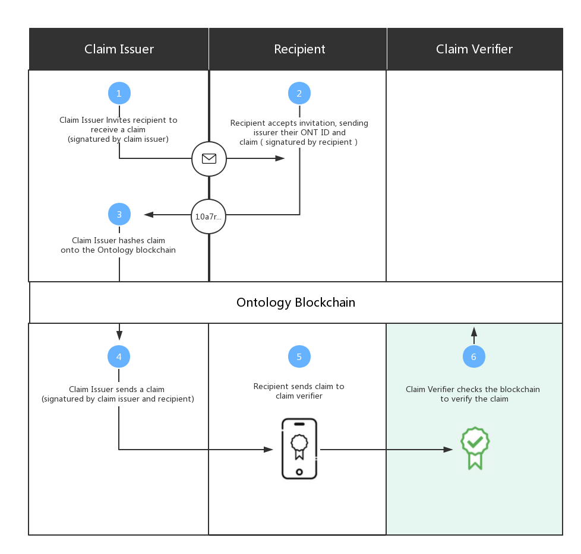

[中文版](./README_cn.md)

<h1 align="center">ONT ID Identification Protocol and Trust Framework</h1>
<h4 align="center">Version V0.6.0 </h4>

## Introduction

ONT ID is a decentralized identification protocol that supports collaborative services such as distributed and diversified ownership confirmation, identification, and authentication of various entities including individuals, legal entities, objects, and contents. ONT ID establishes a cryptographically-based digital identity for each entity, allowing self-sovereign of data authorization and ownership confirmation, which makes the identity and data truly assets that the user can control. ONT ID has the characteristics of decentralization, self-management, privacy protection, security and ease of use.

Ontology establishes a decentralized trust model and distributed trust delivery system through ONT ID and verifiable claim, and uses the C-L signature algorithm and zero-knowledge proof protocol to assure privacy protection of verifiable claim. Through ONT ID, Ontology will also incorporate various authentication service agencies, and establish multi-source authentication of the entity’s identity to achieve complete identity portrait.

In addition to relying on specific central entities to build trust relationships, entities can also build equally strong trust relationships by themselves. Trust transfer is achieved through mutual authentication between entities. Entities will have higher credibility if they receive more authentications from other entities – especially if those other entities have high credibility.

## How it works

Before using the platform, it is a good suggestion for you to first understand the principle of the decentralized trust mechanism.

In the entire trust ecosystem, the following participating roles will be included.

* **The Owners of the User's Recipient ONT ID** They can accept a verifiable claim issued by Verifier or issue a verifiable claim for others.

* **Claim Issuer** “Claim Issuer” refers to the partner that provides authentication services on the Ontology ecosystem. It may be government agencies, universities, banks, third-party authentication service agencies (such as CA agencies), biometric technology companies, etc. They provide multi-dimensional authentication for the owner of the ONT ID and record the HASH of authentication behavior and authentication result through the Ontology blockchain at the first time, thereby providing a standardized and credible authentication method for the user authentication requester.

* **Claim Verifier** Claim Verifier can accept the user's verifiable claim and verify the situation such as the employers who need to verify the interviewer's identity information/degree/industry skills.

* **Application Developer** Developer provides various application development services for users and various scenarios based on the ONT ID protocol and API.

### **Identification Protocol**

“Entity” refers to individuals, legal entities (organizations, enterprises, institutions, etc.), objects (mobile phones, automobiles, IoT devices, etc.), and contents (articles, copyrights, etc.) in the real world, and “identity” refers to the entity's identity within the network. Ontology uses Ontology Identifier (ONT ID) to identify and manage the entities' identities. On Ontology blockchain, one entity can correspond to multiple individual identities, and there is no relation between multiple identities.

[>> Learn more](./docs/en/ONTID_protocol_spec.md)

### **Verifiable Claim Protocol**

A statement to confirm a claim made by one entity about another (including themselves). The claim is accompanied by a digital signature that can be used by other entities for authentication. The verifiable claim protocol describes in detail the procedures and specifications about issue, store, and verification of verifiable claim.

>> TODO Learn more

## Getting Started

ONT ID identification protocol and the trust framework have been completely implemented on the Ontology blockchain through smart contract. You only need to call our various SDKs or RPC interfaces to use.

Enter [>>Quick Development Guide ](./docs/en/get_started.md)to Get Started.

Of course, you can also refer directly to our various SDKs and RPC interfaces, including the following:

* [>> JAVA SDK](https://git.ont.io/Ontology_Open_Platform/ont-sdk-java) 

* [>> TS SDK](https://git.ont.io/OntologyNetwork/ont-sdk-ts)  

If you are an authentication service partner, please go to [>> Authentication Service Partner Access Standard](./docs/en/verification_provider_specification.md) for details.

