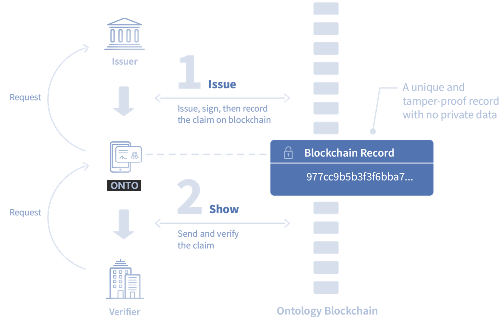
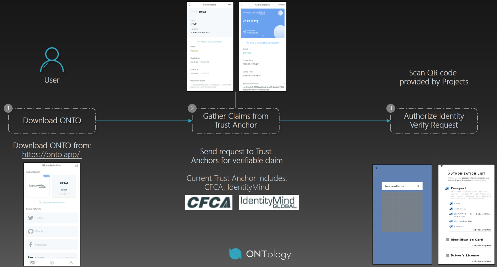

[English](../en/products.md) / 中文

<h1 align="center">应用产品及服务介绍 </h1>

Version 0.9.0 

基于ONTID协议及框架体系，我们推出ONTO综合客户端产品，并连接了可以服务全球的身份认证服务供应商，包括IdentityMind、CFCA、商汤科技、ShiftPro等等，同时ONTO还支持邮箱、手机、社交媒体认证。在不远的将来，ONTO还将连接更多信任源。

ONTO为生态合作伙伴提供认证服务，其原理如下：

* 第一步，用户使用ONTO获取认证（基于可信申明规范），发行方（Issuer）将认证结果通过区块链进行存证；
* 第二步，用户使用ONTO出示给场景方（Verifier），场景方收到认证结果，可以到区块链验证，无需担心真假问题。

从用户视角，流程是这样的：

## 产品及服务

根据使用场景，可提供Login和KYC两种类型的服务。

